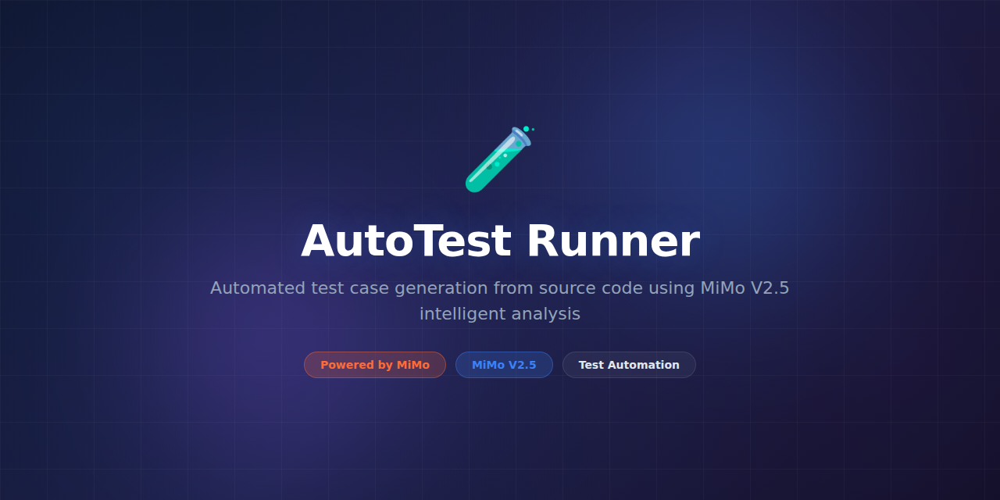

# AutoTest Runner



> **Powered by MiMo** — built on top of Xiaomi's [MiMo](https://platform.xiaomimimo.com) reasoning models for intelligent test generation and code understanding.

[](https://opensource.org/licenses/MIT)
[](https://platform.xiaomimimo.com)
[](https://www.python.org/downloads/)

---

## Why MiMo

Writing tests is one of the most tedious yet critical parts of software engineering. Developers know they should write more tests, but the friction of understanding code paths, setting up fixtures, constructing edge cases, and writing meaningful assertions means test coverage often lags behind feature development. The result: bugs ship to production that could have been caught with better test coverage.

MiMo V2.5 can read and understand code the way a senior developer does — tracing control flow, identifying edge cases, understanding error conditions, and generating meaningful assertions. Its reasoning capability means it doesn't just write tests that compile; it writes tests that actually validate behavior, cover boundary conditions, and catch the subtle bugs that developers miss when writing tests manually.

The model's code understanding extends beyond individual functions. MiMo reasons about how modules interact, how data flows through a system, and where integration points are most likely to break — producing test suites that catch integration bugs, not just unit-level issues. This holistic understanding is what sets it apart from simple code generation tools.

## Token consumption

| Agent | Model | Tokens/run | Frequency | Daily/user |
|---|---|---|---|---|
| Code Analyzer | MiMo V2.5 | ~5,200 | Per module | ~52,000 |
| Test Generator | MiMo V2.5 | ~4,600 | Per test file | ~46,000 |
| Edge Case Finder | MiMo V2.5 | ~2,400 | Per function | ~48,000 |
| **Total** | | **~12,200** | | **~146,000** |

> Estimates based on generating tests for an average module with 15-20 functions.

## What it does

AutoTest Runner analyzes your codebase, understands function signatures and logic flow, then generates comprehensive test suites including unit tests, integration tests, and edge case coverage. It supports multiple testing frameworks and languages, producing production-ready test files with meaningful assertions and proper fixtures.

## Why this exists

The average open-source project has less than 40% test coverage. Startups ship features without tests because writing them is slow and boring. Manual test writing is the first thing cut under deadline pressure. AutoTest Runner removes the friction — point it at your code and get meaningful test coverage in minutes, not days.

## Features

- Automatic test generation from source code analysis
- Unit, integration, and edge case test creation
- Multi-language support (Python, JavaScript, TypeScript, Go)
- Framework-aware output (pytest, Jest, Go testing, unittest)
- Fixture and mock generation from function signatures
- Coverage gap analysis with prioritized suggestions
- CI/CD integration for incremental test generation on diffs
- Test quality scoring and validation (ensures tests actually run)
- Configurable test style (descriptive vs. minimal)
- Batch mode for entire codebase processing

## Tech Stack

- **Runtime:** Python 3.11+
- **AI Engine:** MiMo V2.5 via Xiaomi Platform API
- **Parsers:** tree-sitter (multi-language AST parsing)
- **Test Runners:** pytest, Jest, Go test, unittest
- **Storage:** SQLite (project cache, coverage history)
- **CLI:** Click with rich terminal output
- **Infra:** Docker, GitHub Actions

## Quickstart

```bash
# Clone and install
git clone https://github.com/your-org/AutoTest-Runner.git
cd AutoTest-Runner
pip install -e ".[dev]"

# Configure
cp .env.example .env
# Set MIMO_API_KEY in .env

# Generate tests for a single file
python -m autotest generate src/utils.py

# Generate tests for an entire directory
python -m autotest generate src/ --recursive --framework pytest

# Analyze coverage gaps
python -m autotest coverage src/ --show-gaps

# Generate tests for a specific function
python -m autotest generate src/auth.py --function validate_token

# Run generated tests to verify they pass
pytest tests/generated/ -v

# Run via Docker
docker run -v $(pwd):/project autotest generate /project/src/
```

## Project Structure

```
AutoTest-Runner/
├── assets/
│   └── banner.png
├── autotest/
│   ├── __init__.py
│   ├── runner.py               # Main CLI orchestrator
│   ├── analyzer.py             # MiMo code understanding
│   ├── generator.py            # Test generation engine
│   ├── parser.py               # tree-sitter AST parsing
│   ├── fixtures.py             # Mock and fixture generation
│   ├── coverage.py             # Coverage gap analysis
│   ├── scorer.py               # Test quality scoring
│   ├── validator.py            # Generated test validation
│   └── templates/              # Framework-specific templates
│       ├── pytest.jinja2
│       ├── jest.jinja2
│       └── go_test.jinja2
├── tests/
│   ├── test_generator.py
│   ├── test_parser.py
│   └── fixtures/
├── .env.example
├── Dockerfile
├── pyproject.toml
└── README.md
```

## Contributing

See [CONTRIBUTING.md](CONTRIBUTING.md) for guidelines. We welcome new language parsers, test templates, and framework integrations.

## Configuration

Customize test generation behavior:

```yaml
# autotest.yaml
generation:
  framework: "pytest"
  style: "descriptive"    # or "minimal"
  max_tests_per_function: 8
  include_edge_cases: true
  include_boundary_values: true

fixtures:
  auto_mock_external_calls: true
  use_factories: true
  faker_locale: "en_US"

output:
  directory: "tests/generated/"
  naming: "{module}_test.py"
  docstrings: true

ignore:
  patterns: ["__pycache__", "*.pyc", "conftest.py"]
```

## License

MIT License — see [LICENSE](LICENSE) for details.

---

*Built with ❤️ using MiMo reasoning models.*
